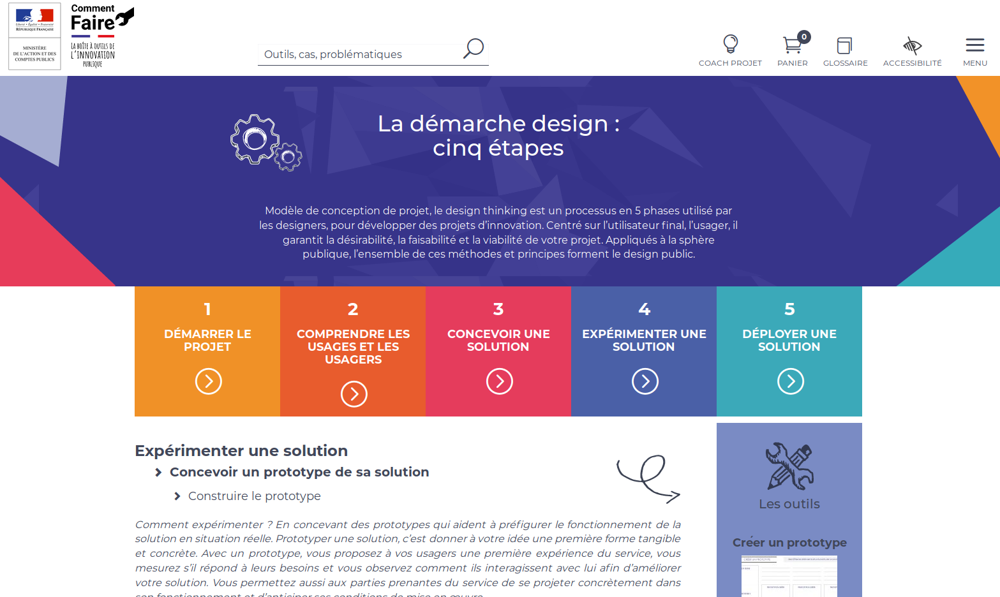
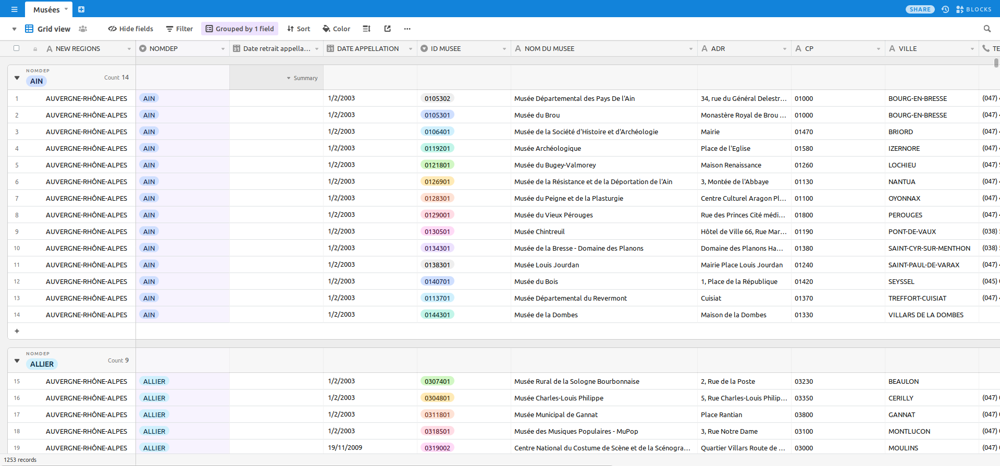
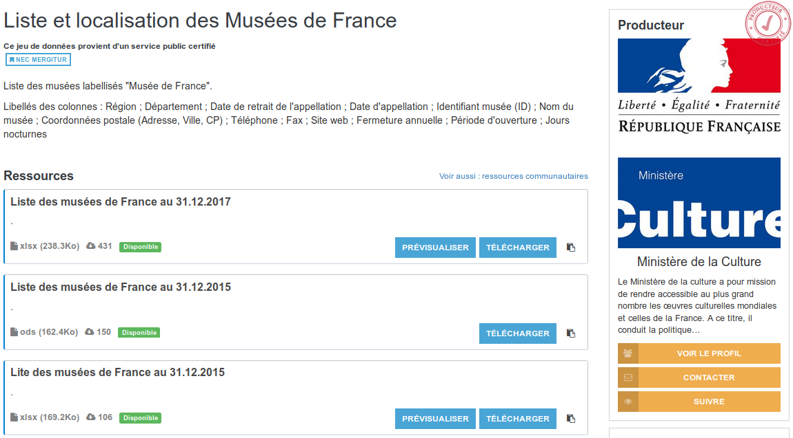

layout: true
  

`r paste0("
", params$event, " 

")` 

---

class: center, middle

Ces slides en ligne : `r paste0("http://datactivist.coop/", params$slug)`

Sources : `r paste0("https://github.com/datactivist/", params$slug)`

Les productions de Datactivist sont librement réutilisables selon les termes de la licence [Creative Commons 4.0 BY-SA](https://creativecommons.org/licenses/by-sa/4.0/legalcode.fr).

 
 

---
class: inverse, center, middle

# Prototyper... Pourquoi ? C'est quoi ? 

---

[.center[]](http://comment-faire.modernisation.gouv.fr/demarche-design/experimenter-une-solution/concevoir-un-prototype-de-sa-solution/construire-le-prototype/)

---
## Prototyper pour...

- établir les fonctionnalités
- vérifier qu'elles répondent bien aux besoins des usagers
- faire émerger des problèmes qu'on n'avait pas vu
- faire émerger des besoins passés inaperçus

=> une étape essentielle de la création de services !

=> un moyen aussi de tester l'utilité des données ouvertes

---
## Quelques outils de prototypage

- [Umap](https://umap.openstreetmap.fr/fr/) pour la cartographie
- [Workbench](https://workbenchdata.com/) pour automatiser des process de traitement des données
- [Airtable](https://airtable.com/invite/r/u2PpI7Kl)
- [Landbot](http://landbot.io) pour prototyper un chatbot
- du papier, des post-its et des crayons !

---
## Airtable, passer de données plates à des données structurées

Airtable est entre un logiciel de tableur (Excel, LibreOffice Calc, Google Spreadsheets...) et une base de données structurées (SQL)... mais nativement web et avec une interface plus efficace !

---
## Prototyper un catalogue de musées

Le Ministère de la Culture publie la [liste des Musées de France](https://www.data.gouv.fr/fr/datasets/liste-et-localisation-des-musees-de-france/) sur data.gouv.fr :

---
## Prototyper un catalogue de musées

Des données, c'est bien... des usages, c'est mieux ! 

Et si on prototypait un petit catalogue ?

---
## Les principales étapes :

- télécharger les données depuis [data.gouv.fr](https://www.data.gouv.fr/fr/datasets/liste-et-localisation-des-musees-de-france/)
- les transformer en CSV
- les importer dans Airtable
- qualifier les variables
- créer une gallerie publiable

---
## Pour aller plus loin

- les "blocks" d'Airtable (version pro)
- https://table2site.com/ pour transformer sa base en site

---
## Et maintenant...

Testez, faites tester ! 

---
class: inverse, center, middle

# Merci !

Contact : [joel@datactivist.coop](mailto:joel@datactivist.coop)

